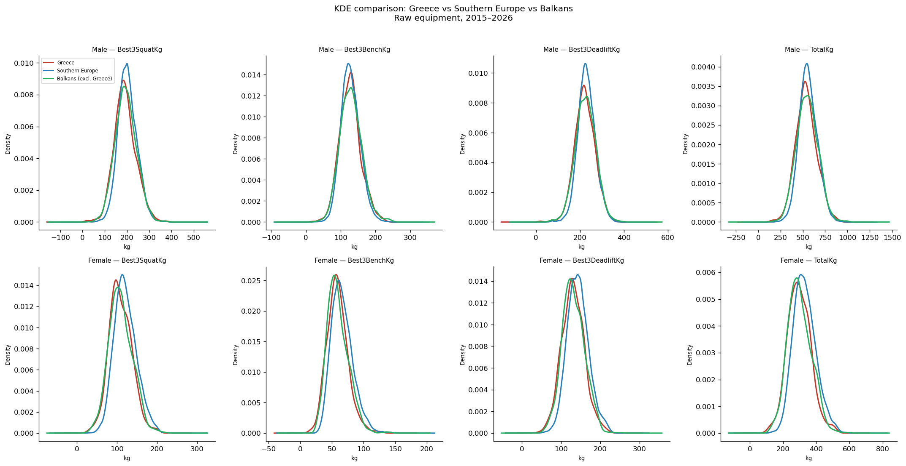
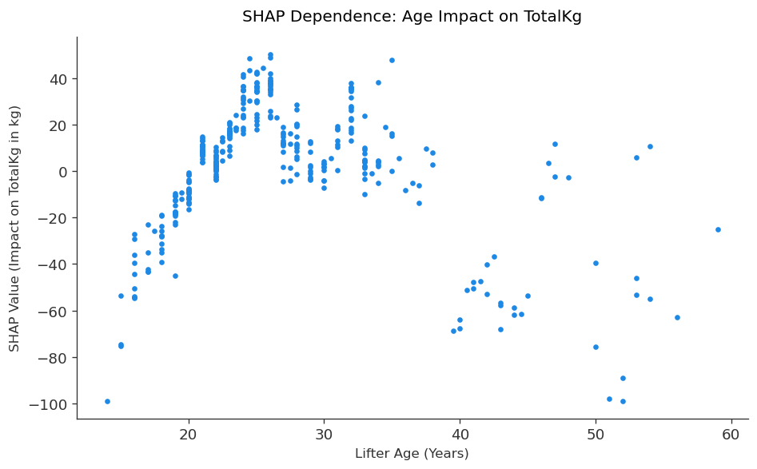
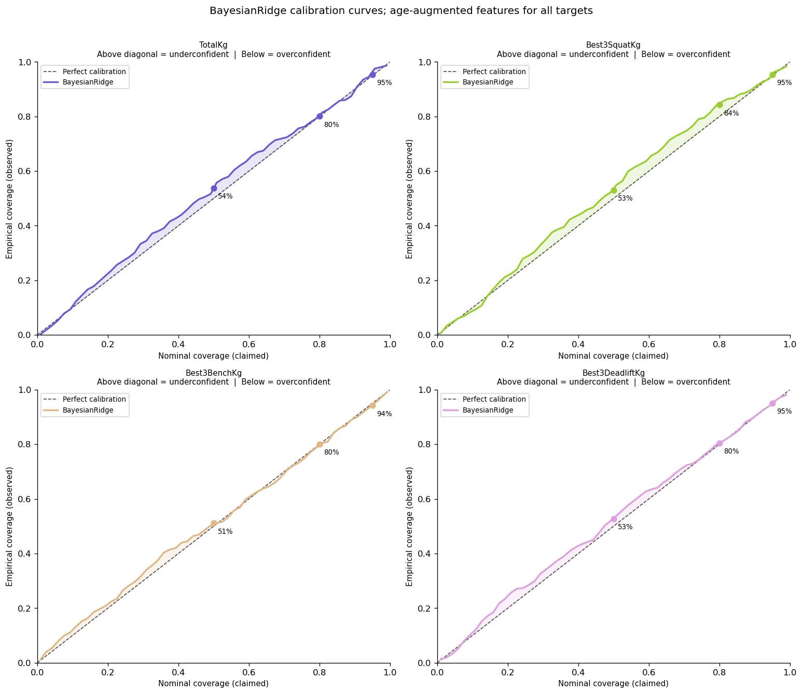

# Greek Powerlifting Performance Prediction

**Overview:** This project builds a performance prediction and uncertainty
quantification system for Greek raw powerlifters using the OpenPowerlifting
dataset. The goal is not simply to minimise prediction error, but to build a
pipeline that is honest about what the available features can and cannot
predict — and to quantify that uncertainty explicitly for each athlete
profile. The project is structured around eight phases, three modelling
approaches, and a strength standards tool that a coach or athlete can run
interactively.

**Status:** Phases 1–7 complete. Phase 8 (Strength Standards Tool) in
progress — the final phase.

**Data:** OpenPowerlifting, 2026-08-01 release (CC BY 4.0).
Fetch instructions below — the raw CSV is not committed (> 700 MB).

**Looking for a plain-language explanation instead?** See
[`ATHLETES.md`](ATHLETES.md) — no formulas, just what the tool tells you and
how to use it.

---

## Three findings, in pictures

**Greek raw lifters perform comparably to their regional peers — once the
data is cleaned properly.** The raw data mixed bench-only, push-pull, and
full-power meets into a single "Total" column, producing a spurious bimodal
distribution. After restricting to full-power (SBD) competitions, Greece
sits almost on top of Southern Europe and the Balkans on every lift:



**Age's effect on performance is genuinely non-linear — confirmed, not just
assumed.** A linear model can only fit age as a straight line; SHAP values
extracted from the tuned gradient-boosted model show the actual shape: a
steep rise through the mid-20s, a plateau through the early 30s, and a
consistent decline thereafter.



**The uncertainty intervals are honest, not just claimed.** A calibration
curve compares the coverage a model *claims* (x-axis) against what it
*actually delivers* on held-out data (y-axis). A well-calibrated model hugs
the diagonal — which is what the age-augmented BayesianRidge model does
here, across the full range of confidence levels.



---

## Project Structure

```
.
├── greek_powerlifting_analysis.ipynb   ← main notebook
├── README.md                           ← this file (technical)
├── ATHLETES.md                         ← plain-language explainer
├── plots/
│   ├── phase1/                         ← EDA figures
│   ├── phase2/                         ← preprocessing figures
│   ├── phase3/                         ← regression figures
│   ├── phase4/                         ← evaluation figures
│   ├── phase5/                         ← boosting & SHAP figures
│   └── phase6/                         ← Bayesian calibration figures
└── data/
    └── (raw CSV not committed — see below)
```

---

## Phase Overview

### Phase 1 — EDA & Cleaning ✓
**Goal:** define a clean, well-characterised modelling cohort and understand
the data's structure.

**Motivation:** the raw OpenPowerlifting data interleaves event types
(bench-only, push-pull, full-power) in a single TotalKg column. Without
understanding and correcting for this, the whole model would be built on a
confounded quantity.

**Approach:** a seven-step filtering funnel (Greek → raw equipment → SBD
full-power → valid total → no fourth attempts → 2015 onwards →
deduplicated), followed by comparative analysis against Southern European and
Balkan peers on all four targets.

---

### Phase 2 — Feature Engineering & Preprocessing ✓
**Goal:** turn the cohort into leakage-free, well-conditioned feature matrices
ready for modelling.

**Motivation:** the scoring columns (Dots/Wilks/Goodlift) are deterministic
functions of TotalKg and bodyweight — they are the target repackaged and must
be excluded. Federation composition and age missingness require principled
decisions before any model sees the data.

**Approach:** baselines first (predict-mean, per-sex mean, per-sex bodyweight
regression — the floors every model must beat), then feature construction,
train-only scaling, and a diagnostic suite (leakage audit, condition number
check).

---

### Phase 3 — Classical Regression ✓
**Goal:** implement linear regression from first principles and validate it.

**Motivation:** implementing OLS, gradient descent, Ridge, and Lasso from
scratch demonstrates the mathematics is understood, not just called;
validating against sklearn confirms correctness.

**Approach:** normal equation via `np.linalg.lstsq`, then batch gradient
descent verified to converge to the same solution (< 0.001 kg difference),
then Ridge and Lasso from scratch, then sklearn validation confirming all
implementations match to four decimal places. Ridge does not improve over OLS
(condition number 3.3 — well-conditioned matrix); Lasso retains all features
with one exception: age-augmented TotalKg, where Lasso finds a real optimum
at λ = 1.79 and improves RMSE by 0.11 kg. Stratified and unstratified 5-fold
CV confirm the single-split estimates are stable.

---

### Phase 4 — Evaluation & Analysis ✓
**Goal:** move beyond a single held-out RMSE and determine where the models
succeed, where they fail, and why — across demographic subgroups, across
targets, and across the bias-variance spectrum.

**Motivation:** an aggregate RMSE hides subgroup-level failure. A model can
look reasonable overall while explaining almost no variance for a specific
demographic, and a single train/test split cannot distinguish underfitting
from overfitting.

**Approach and findings:**
- **Sex-stratified performance:** RMSE is lower for female lifters across
  every target (smaller absolute totals), but R² is markedly worse and
  negative for several base-feature targets — the model explains
  comparatively little of the variance within the female subgroup, even
  though absolute errors look reasonable.
- **Age-category performance:** the Masters subgroup is poorly explained
  under both feature sets, consistent with small sample size (33–35 rows)
  rather than a missing feature.
- **Bias-variance diagnosis:** training RMSE and CV RMSE are close across
  every target and feature variant — the model is in a high-bias, not
  high-variance, regime.
- **Residual correlation:** squat-deadlift residuals correlate most
  strongly (0.80), consistent with the model's errors being shared across
  lifts rather than independent per lift.

---

### Phase 5 — Gradient Boosting ✓
**Goal:** explore whether a model with more functional flexibility than a
linear one can improve on Phase 3–4's classical results.

**Motivation:** Phase 4 established the linear models were underfitting.
A specific mechanism was hypothesised: the relationship between age and
performance is plausibly non-monotonic — a shape a linear model can only fit
as a straight line, but a tree-based model can capture via threshold splits.

**Approach and findings:**
- **Baseline (untuned) XGBoost vs. OLS/Ridge:** untuned boosting already
  beat the linear models on every target, with the largest gains
  concentrated in the age-augmented feature set (TotalKg −6.67 kg vs. OLS).
- **Optuna hyperparameter tuning** (100 trials per target/variant, TPE
  sampler) widened these gains further. *Disclosed caveat: the search
  optimises against the same CV folds used to report results — a mild
  leakage likely making the reported improvement a modest overestimate.*
- **SHAP analysis** confirmed the age-nonlinearity hypothesis directly (see
  figure above): Age ranks third in importance across all four targets, and
  SHAP dependence plots show the predicted shape explicitly.

---

### Phase 6 — Bayesian Ridge: Coverage & Calibration ✓
**Goal:** move beyond point predictions and quantify per-prediction
uncertainty. Standard Ridge gives a single number with no indication of
confidence; BayesianRidge gives a mean plus a calibrated interval.

**Motivation:** Phase 5 produced a model that predicts well but still
returns only a point estimate per athlete. Useful interpretation needs an
honest sense of how much to trust that number.

**Approach and findings:**
- **MAP-Ridge identity verified numerically:** at matched λ, BayesianRidge
  and Ridge coefficients agree to ~1e-12 — BayesianRidge changes nothing
  about the point prediction, only adds calibrated uncertainty around it.
- **Empirical coverage** at four nominal levels (50/68/80/95%), across all
  eight target/variant combinations, tracked nominal levels closely (within
  1–5 percentage points) — the intervals are genuinely well-calibrated on
  unseen data (see figure above).

---

### Phase 7 — Uncertainty Quantification ✓
**Goal:** give a rigorous, calibrated notion of uncertainty to the model
actually established as best — tuned XGBoost — since Phase 6's BayesianRidge
was built on Ridge, a model Phase 5 had already shown was beaten on every
target.

**Motivation:** conformal prediction is model-agnostic and distribution-free,
requiring no analytic posterior or Gaussian error assumption — it wraps
directly around tuned XGBoost's predictions using only empirical calibration
residuals.

**Approach and findings:**
- **Split-conformal prediction** wrapped around tuned XGBoost for all eight
  target/variant combinations, using the exact finite-sample quantile
  correction $k = \lceil(n_{\text{cal}}+1)(1-\alpha)\rceil$, calibrated on a
  fresh 50/50 stratified split of each existing test set.
- **A systematic male/female coverage asymmetry** emerged across all eight
  combinations, with no exceptions: female coverage exceeded male at every
  confidence level — driven by a single pooled calibration quantile
  dominated by the majority (male) group's error scale. Bench showed the
  widest gap of the three lifts (34.7 points at the 50% level).
- **The same asymmetry was independently confirmed under BayesianRidge**,
  establishing it as a property of the dataset's sex-scale heterogeneity,
  not an artifact of either uncertainty method.
- **BayesianRidge vs. conformal-XGBoost comparison:** conformal intervals
  were narrower in 30 of 32 target/variant/confidence-level combinations,
  with comparable or better coverage — most plausibly because XGBoost's
  residuals are simply better than Ridge's.

---

### Phase 8 — Strength Standards Tool *(in progress)*

An interactive cell for athletes and coaches. Given bodyweight, sex, age,
and federation, the tool produces two independent estimates of total —
one predicted directly, one summed from separate squat/bench/deadlift
predictions, as a built-in consistency check — each reported with a
calibrated uncertainty interval from Phases 6–7. Uses the age-augmented
tuned XGBoost models exclusively, since age is a required input.

---

## Reproducing the Analysis

**Fetch the data:**

```bash
cd data/
curl -fL -o openpowerlifting-latest.zip \
  "https://openpowerlifting.gitlab.io/opl-csv/files/openpowerlifting-latest.zip"
unzip -o openpowerlifting-latest.zip
mv openpowerlifting-*/openpowerlifting-*.csv .
```

The notebook auto-detects the newest dated CSV in `data/` — no code change
needed after fetching. To reproduce the exact results in this notebook, use
the 2026-08-01 release (hash `55149139`, 778 MB).

**Dependencies:**

```
numpy
pandas
matplotlib
seaborn
scipy
scikit-learn
xgboost
optuna
shap
```

Install via:

```bash
pip install numpy pandas matplotlib seaborn scipy scikit-learn xgboost optuna shap
```

**Run:** open `greek_powerlifting_analysis.ipynb` in JupyterLab and run all
cells from top to bottom. Cells have execution dependencies — do not run
individual cells out of order.

---

## Key Results

| Model | Cohort | Features | Test RMSE |
|-------|--------|----------|-----------|
| Predict-mean baseline | Total | — | 145.9 kg |
| Per-sex mean baseline | Total | — | 109.1 kg |
| Per-sex BW regression baseline | Total | — | 94.4 kg |
| OLS (normal equation) | Total | Base | 93.2 kg |
| OLS (normal equation) | Total | + Age | 87.1 kg |
| Ridge (optimal λ) | Total | Base | 93.2 kg |
| Ridge (optimal λ) | Total | + Age | 87.1 kg |
| Lasso (optimal λ) | Total | Base | 93.2 kg |
| Lasso (optimal λ = 1.79) | Total | + Age | 87.0 kg |
| XGBoost, untuned | Total | Base | 91.5 kg |
| XGBoost, untuned | Total | + Age | 82.2 kg |
| XGBoost, Optuna-tuned | Total | Base | 89.1 kg |
| XGBoost, Optuna-tuned | Total | + Age | **81.4 kg** |

**Uncertainty quantification (TotalKg, age-augmented, 95% nominal):**

| Method | Interval half-width | Overall coverage | Male | Female |
|--------|---------------------|-------------------|------|--------|
| BayesianRidge (on Ridge) | ± 174.9 kg | 95.4% | 95.2% | 96.0% |
| Split-conformal (on tuned XGBoost) | ± 162.4 kg | 94.5% | 93.1% | 100.0% |

The male/female coverage asymmetry above is systematic — present at every
confidence level, across all eight target/variant combinations, and under
both uncertainty methods (see Phase 7). It reflects the underlying sex-scale
heterogeneity in the data, not a flaw specific to either method.

All scratch implementations validated against sklearn to four decimal places.
Per-lift (squat / bench / deadlift) results, subgroup breakdowns, and
diagnostic plots — including SHAP age-dependence, Bayesian calibration
curves, and conformal coverage tables — available in the notebook.

---

## Attribution

All competition data sourced from the OpenPowerlifting project
(https://openpowerlifting.gitlab.io) under CC BY 4.0.
Analysis and code by Kostas Rigatos, 2026.
